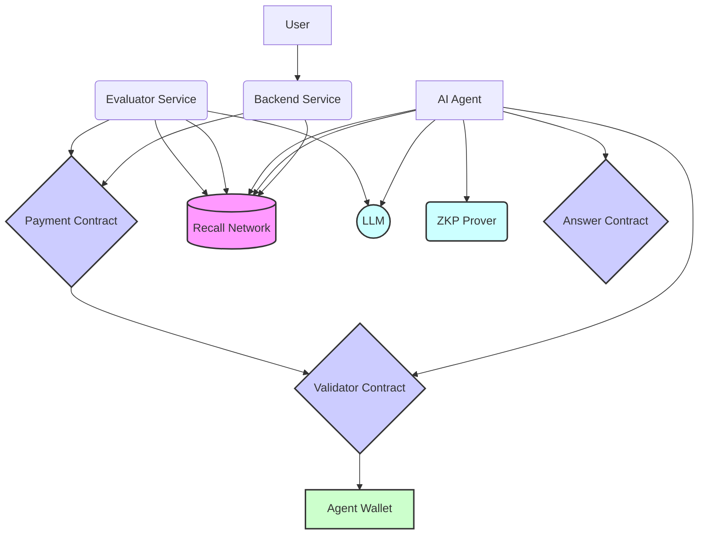

# KinTask: Verifiable & Attributed AI Q&A

**KinTask** demonstrates a framework for trustworthy and verifiable question-answering using a synergy of decentralized technologies and AI. It establishes a transparent process from job creation to agent execution and payment, leveraging on-chain attestations and verifiable computation.

1.  A **Backend Service** initiates tasks by creating on-chain payment offers using the **Coophive Ethereum Attestation Service (EAS)** and escrowing funds in a smart contract.
2.  **AI Agents** discover these tasks by monitoring a **Decentralized Logging Network (Recall)**, where job details (including the payment offer attestation UID) are recorded.
3.  Agents retrieve knowledge fragments from **Decentralized Storage (Filecoin/IPFS)** using CIDs specified in the job.
4.  Agents use **LLMs** to generate answers based on the question and retrieved knowledge.
5.  Agents generate a **Zero-Knowledge Proof (ZKP)** (currently demonstrating proof-of-computation) verifying their work according to predefined rules.
6.  Agents submit their results and ZKP proofs on-chain via **EAS Attestations** (`AnswerStatement`).
7.  An on-chain **`ZKPValidator`** contract automatically verifies the submitted ZKP using a **`Groth16Verifier`** contract and issues a final **EAS Attestation** confirming the validation result.
8.  A **Backend Evaluation Service** assesses the quality of the agent's answer (using an LLM) and checks for the successful on-chain ZKP validation attestation by querying **Recall**.
9.  Based on both the LLM evaluation and the on-chain ZKP validation, the **Backend Service** triggers the release of escrowed funds from the **`ERC20PaymentStatement`** contract to the successful agent. The payment release itself is gated by the `ZKPValidator` acting as an **on-chain arbiter**.
10. The entire lifecycle, including UIDs of all on-chain attestations (offer, answer submission, ZKP validation) and evaluation/payout results, is logged transparently on the **Recall Network**.

## The Problem

Standard LLMs often lack verifiable grounding and can "hallucinate" – producing incorrect or nonsensical information with high confidence. Current AI systems offer little transparency into their reasoning process or the data sources used. This limits trust and accountability. Furthermore, verifying that a remote agent actually performed the requested computation (like running an LLM or generating a proof) and ensuring fair payment for valid work is challenging in decentralized or open environments.

## Our Solution: KinTask

KinTask addresses these issues by integrating cutting-edge Web3 technologies:

*   **Decentralized Storage (Filecoin/IPFS):** Knowledge bases are referenced by Content Identifiers (CIDs), allowing agents to retrieve data from verifiable, decentralized storage networks.
*   **Verifiable Computation (ZKPs):** Agents generate ZKPs to prove they performed the required computational steps (e.g., proof generation itself). This proof is verified *on-chain* by smart contracts, providing strong cryptographic assurance of execution.
*   **On-Chain Attestations (EAS):** EAS provides a standardized, interoperable, and verifiable on-chain registry for crucial events: the initial job offer with escrowed payment (`ERC20PaymentStatement`), the agent's submission (`AnswerStatement`), and the result of the ZKP validation (`ZKPValidator`). This creates an immutable audit trail.
*   **Automated Arbitration & Payment (Smart Contracts):** The payment contract (`ERC20PaymentStatement`) uses the `ZKPValidator` contract as an automated arbiter. Payment is released *only* if the `ZKPValidator` confirms (via its `checkFulfillment` function checking the final validation attestation) that the agent submitted a valid ZKP.
*   **Transparent Logging (Recall Network):** The Recall Network provides a decentralized, tamper-resistant logbook for all off-chain events and pointers to on-chain transactions/attestations, making the entire workflow transparent and auditable by any participant.

## Architecture Diagram (KinTask - ZKP/EAS Flow)

## Key Components Explained

*   **ERC20PaymentStatement:** A smart contract that holds escrowed funds and emits an EAS attestation representing the payment offer. It relies on an external `arbiter` contract to validate fulfillment before releasing payment.
*   **AnswerStatement:** A smart contract used by agents to submit their results (or hashes thereof) and ZKP proof data as an EAS attestation. It references the original payment statement.
*   **ZKPValidator:** A smart contract that acts as the designated `arbiter` for the `ERC20PaymentStatement`. It contains logic to verify ZKPs (by calling a separate `Verifier` contract) submitted via `AnswerStatement` attestations and issues its own EAS attestation confirming the validation result. Its `checkFulfillment` method is called by the payment contract during payout attempts.
*   **Groth16Verifier:** A standard Solidity contract (generated by `snarkjs`) containing the verification key for the specific ZKP circuit used, capable of verifying proofs on-chain.
*   **Ethereum Attestation Service (EAS):** The underlying infrastructure contract (on L2 or the target chain) used by the other contracts to create and register schema-based attestations on-chain.
*   **Recall Network:** The off-chain decentralized logging layer used to store metadata, workflow status, and pointers (UIDs) to the on-chain attestations, facilitating discovery and coordination between participants.
*   **Agent:** An off-chain script/program that monitors Recall, performs LLM inference, generates ZKPs, interacts with the smart contracts (submitting answers, triggering validation), and logs results back to Recall.
*   **Backend / Evaluator Service:** Off-chain services responsible for accepting user requests, creating initial payment statements, optionally evaluating answer quality using LLMs, triggering the final payment release based on evaluation and ZKP validation, and logging status updates to Recall.

